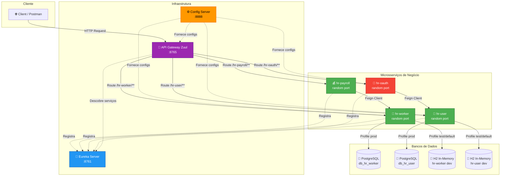
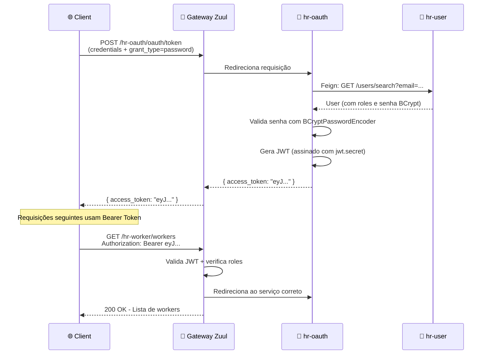
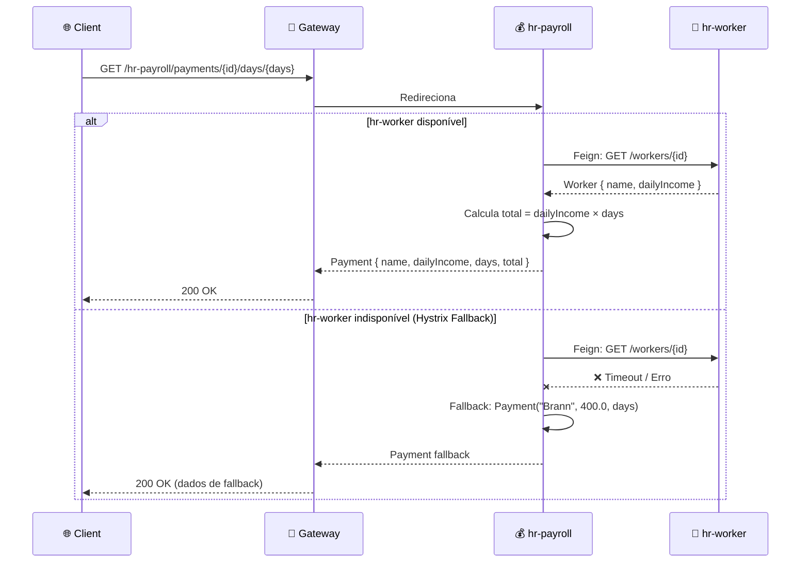
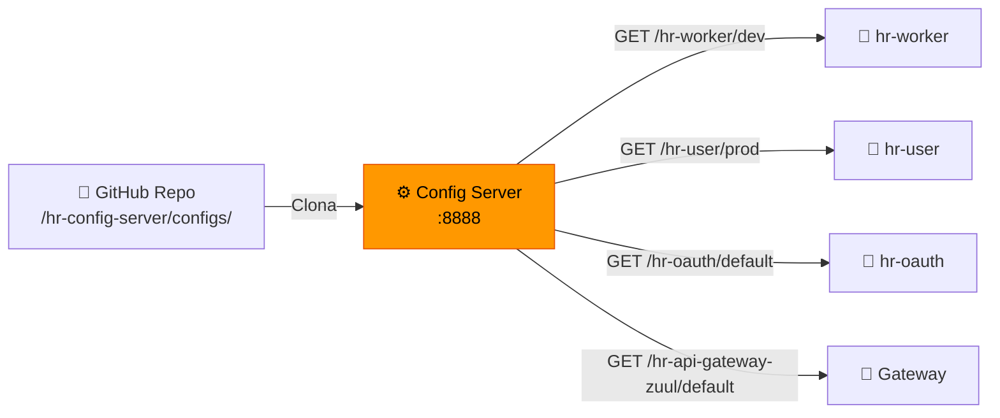
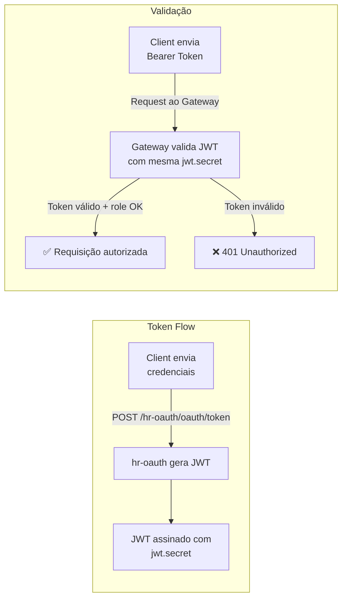

# 🏢 HR Microservices — Spring Boot & Spring Cloud

<div align="center">


**Sistema de RH baseado em arquitetura de microsserviços com service discovery, API gateway, configuração centralizada, autenticação OAuth2/JWT e circuit breaker.**

</div>

---

# 📑 Índice

- [🏛️ Arquitetura](#️-arquitetura)
- [🧩 Módulos do Projeto](#-módulos-do-projeto)
- [⚙️ Stack Tecnológica](#️-stack-tecnológica)
- [🔧 Configuração Centralizada & Profiles](#-configuração-centralizada--profiles)
- [🚀 Como Executar](#-como-executar)
  - [📋 Pré-requisitos](#-pré-requisitos)
  - [🖥️ Execução Local (Profile Dev)](#️-execução-local-profile-dev)
  - [🐳 Execução com Docker (Profile Prod)](#-execução-com-docker-profile-prod)
- [🐘 Banco de Dados PostgreSQL](#-banco-de-dados-postgresql)
- [🔐 Autenticação e Autorização](#-autenticação-e-autorização)
- [📮 Collection Postman](#-collection-postman)
- [🛠️ Configuração do VS Code](#️-configuração-do-vs-code)

---

# 🏛️ Arquitetura

O projeto segue o padrão de arquitetura de microsserviços, onde cada serviço possui responsabilidade isolada e se comunica via REST. Toda a infraestrutura é orquestrada por componentes do Spring Cloud.

## Diagrama Geral



## Fluxo de Autenticação



## Fluxo de Cálculo de Pagamento (com Circuit Breaker)



---

# 🧩 Módulos do Projeto

O projeto é organizado como um **multi-module Maven** com um POM pai (`hr-parent`) que centraliza versões e dependências comuns.

| Módulo | Porta | Descrição |
|--------|-------|-----------|
| **hr-config-server** | `8888` | Servidor de configuração centralizado. Busca propriedades de um repositório Git e as distribui para os microsserviços clientes. |
| **hr-eureka-server** | `8761` | Service Discovery. Todos os microsserviços se registram aqui e descobrem uns aos outros por nome lógico. |
| **hr-api-gateway-zuul** | `8765` | API Gateway — ponto único de entrada. Faz roteamento, balanceamento de carga e aplica regras de segurança OAuth2/JWT. |
| **hr-worker** | Aleatória | Microsserviço de trabalhadores. CRUD de `Worker` (id, name, dailyIncome). Conecta-se a PostgreSQL (prod) ou H2 (dev/test). |
| **hr-payroll** | Aleatória | Microsserviço de folha de pagamento. Consome `hr-worker` via Feign Client para calcular pagamentos. Implementa Hystrix como circuit breaker. |
| **hr-user** | Aleatória | Microsserviço de usuários. Gerencia `User` e `Role` com autenticação BCrypt. Conecta-se a PostgreSQL (prod) ou H2 (dev/test). |
| **hr-oauth** | Aleatória | Servidor de autorização OAuth2. Gera e valida tokens JWT. Consome `hr-user` via Feign para autenticar usuários. |

> **💡 Nota:** Os serviços de negócio usam portas aleatórias (`server.port=${PORT:0}`) para permitir múltiplas instâncias registradas no Eureka, viabilizando o load balancing via Ribbon/Zuul.

---

# ⚙️ Stack Tecnológica

## Core

| Tecnologia | Versão | Função |
|-----------|--------|--------|
| **Java** | 11 | Linguagem de programação |
| **Spring Boot** | 2.3.12.RELEASE | Framework base para criação dos microsserviços |
| **Spring Cloud** | Hoxton.SR12 | Ecossistema para arquitetura distribuída |
| **Maven** | 3.x | Build e gerenciamento de dependências (multi-module) |

## Spring Cloud Components

| Componente | Dependência Maven | Onde é usado | Finalidade |
|-----------|-------------------|--------------|-----------|
| **Config Server** | `spring-cloud-config-server` | hr-config-server | Servir configurações centralizadas via Git |
| **Config Client** | `spring-cloud-starter-config` | hr-worker, hr-user, hr-oauth, hr-gateway | Consumir configurações do Config Server |
| **Eureka Server** | `spring-cloud-starter-netflix-eureka-server` | hr-eureka-server | Registro e descoberta de serviços |
| **Eureka Client** | `spring-cloud-starter-netflix-eureka-client` | Todos (exceto config-server) | Registrar-se no Eureka |
| **Zuul** | `spring-cloud-starter-netflix-zuul` | hr-api-gateway-zuul | API Gateway com roteamento e load balancing |
| **OpenFeign** | `spring-cloud-starter-openfeign` | hr-payroll, hr-oauth | Comunicação declarativa entre microsserviços |
| **Hystrix** | `spring-cloud-starter-netflix-hystrix` | hr-payroll | Circuit breaker para tolerância a falhas |
| **OAuth2** | `spring-cloud-starter-oauth2` | hr-oauth, hr-gateway | Autenticação e autorização com JWT |
| **Ribbon** | (embutido no Zuul/Feign) | hr-gateway, hr-payroll | Client-side load balancing |

## Persistência

| Tecnologia | Versão | Onde é usado | Finalidade |
|-----------|--------|--------------|-----------|
| **Spring Data JPA** | (Spring Boot managed) | hr-worker, hr-user | ORM com Hibernate para acesso a dados |
| **PostgreSQL** | 12-alpine | hr-worker (prod), hr-user (prod/dev) | Banco de dados relacional em produção |
| **H2 Database** | 2.2.220 | hr-worker (dev/test), hr-user (dev/test) | Banco in-memory para desenvolvimento |

## Ferramentas e Utilitários

| Tecnologia | Finalidade |
|-----------|-----------|
| **Lombok** (1.18.24) | Redução de boilerplate (getters, constructors, etc.) |
| **Spring Boot DevTools** | Hot reload em desenvolvimento |
| **Spring Boot Actuator** | Endpoints de monitoramento e refresh de configuração |
| **Docker** | Containerização dos microsserviços |

---

# 🔧 Configuração Centralizada & Profiles

O **hr-config-server** é o coração da configuração. Ele busca arquivos `.properties` de um diretório `configs/` no repositório Git e os distribui aos microsserviços clientes via HTTP.

## Como funciona



## Propriedades Globais (`application.properties`)

Compartilhadas por **todos** os microsserviços clientes que consultam o Config Server:

| Propriedade | Valor | Descrição |
|------------|-------|-----------|
| `oauth.client.name` | `myappname123` | Nome do cliente OAuth2 |
| `oauth.client.secret` | `myappsecret123` | Secret do cliente OAuth2 |
| `jwt.secret` | `MY-SECRET-KEY` | Chave de assinatura JWT |

## Profiles Disponíveis

### 🟢 `hr-worker`

| Profile | Banco | Host DB | Porta DB | Banco de Dados | DDL Auto | Detalhes |
|---------|-------|---------|----------|----------------|----------|----------|
| **default** | H2 (in-memory) | — | — | mem | `create` (padrão JPA) | Usa `import.sql` para seed. Possui `test.config=My config value default profile` |
| **test** | H2 (in-memory) | — | — | mem | `create` (padrão JPA) | Possui `test.config=My config value test profile update` |
| **dev** | PostgreSQL | `localhost` | `5432` | `db_hr_worker` | `none` | Gera script DDL em `hr-worker/create.sql` |
| **prod** | PostgreSQL | `hr-worker-pg12` | `5432` | `db_hr_worker` | `none` | Conecta ao container Docker `hr-worker-pg12` |

### 🟢 `hr-user`

| Profile | Banco | Host DB | Porta DB | Banco de Dados | DDL Auto | Detalhes |
|---------|-------|---------|----------|----------------|----------|----------|
| **default** | H2 (in-memory) | — | — | mem | `create` (padrão JPA) | Usa `import.sql` para seed com usuários e roles |
| **dev** | PostgreSQL | `localhost` | `5433` | `db_hr_user` | `none` | Gera script DDL em `hr-user/create.sql`. Porta `5433` (diferente do hr-worker) |
| **prod** | PostgreSQL | `hr-user-pg12` | `5432` | `db_hr_user` | `none` | Conecta ao container Docker `hr-user-pg12` |

## Atualização dinâmica com Actuator

Os serviços que possuem `@RefreshScope` (como `hr-worker`) podem ter suas configurações atualizadas em runtime:

```bash
# Atualizar configs do hr-worker sem reiniciar
POST http://localhost:8765/hr-worker/actuator/refresh
```

---

# 🚀 Como Executar

## 📋 Pré-requisitos

| Ferramenta | Versão | Necessidade |
|-----------|--------|-------------|
| **JDK** | 11+ | Obrigatório |
| **Maven** | 3.x | Obrigatório |
| **Docker** | 20.x+ | Necessário para profiles `dev`/`prod` com PostgreSQL |
| **Postman** | Qualquer | Recomendado (collection inclusa em `docs/`) |

## 🖥️ Execução Local (Profile Dev)

Neste modo, os serviços `hr-worker` e `hr-user` que usam banco de dados podem se conectar a uma instância PostgreSQL local.

### 1. Subir os bancos PostgreSQL locais

```bash
# Banco do hr-worker (porta 5432)
docker run -d \
  --name hr-worker-pg12-dev \
  -e POSTGRES_DB=db_hr_worker \
  -e POSTGRES_USER=postgres \
  -e POSTGRES_PASSWORD=1234567 \
  -p 5432:5432 \
  postgres:12-alpine

# Banco do hr-user (porta 5433)
docker run -d \
  --name hr-user-pg12-dev \
  -e POSTGRES_DB=db_hr_user \
  -e POSTGRES_USER=postgres \
  -e POSTGRES_PASSWORD=1234567 \
  -p 5433:5432 \
  postgres:12-alpine
```

### 2. Inicializar os schemas

Após os containers estarem rodando, execute os scripts DDL + seed:

```bash
# Schema do hr-worker
docker exec -i hr-worker-pg12-dev psql -U postgres -d db_hr_worker < hr-worker/create.sql

# Schema do hr-user
docker exec -i hr-user-pg12-dev psql -U postgres -d db_hr_user < hr-user/create.sql
```

### 3. Build do projeto

```bash
# Na raiz do projeto
mvn clean install -DskipTests
```

### 4. Iniciar os serviços (ordem importa!)

Os serviços devem ser iniciados na seguinte ordem para garantir que as dependências estejam disponíveis:

```bash
# 1️⃣ Config Server (deve ser o primeiro — fornece configs para todos)
java -jar hr-config-server/target/hr-config-server-0.0.1-SNAPSHOT.jar

# 2️⃣ Eureka Server (service discovery)
java -jar hr-eureka-server/target/hr-eureka-server-0.0.1-SNAPSHOT.jar

# 3️⃣ hr-worker (ajustar profile para dev)
java -jar hr-worker/target/hr-worker-0.0.1-SNAPSHOT.jar --spring.profiles.active=dev

# 4️⃣ hr-user (ajustar profile para dev)
java -jar hr-user/target/hr-user-0.0.1-SNAPSHOT.jar --spring.profiles.active=dev

# 5️⃣ hr-oauth
java -jar hr-oauth/target/hr-oauth-0.0.1-SNAPSHOT.jar

# 6️⃣ hr-payroll
java -jar hr-payroll/target/hr-payroll-0.0.1-SNAPSHOT.jar

# 7️⃣ API Gateway Zuul (último — precisa descobrir os serviços no Eureka)
java -jar hr-api-gateway-zuul/target/hr-api-gateway-zuul-0.0.1-SNAPSHOT.jar
```

> **💡 Dica:** No VS Code, use o arquivo [`docs/launch.json`](docs/launch.json) com as configurações de debug prontas para cada serviço. Copie-o para `.vscode/launch.json`.

### Sobrescrevendo o Config Server URI para desenvolvimento local

Por padrão, os `bootstrap.properties` apontam para `http://hr-config-server:8888` (hostname Docker). Para rodar localmente, sobrescreva:

```bash
java -jar hr-worker/target/hr-worker-0.0.1-SNAPSHOT.jar \
  --spring.cloud.config.uri=http://localhost:8888 \
  --spring.profiles.active=dev \
  --eureka.client.service-url.defaultZone=http://localhost:8761/eureka/
```

## 🐳 Execução com Docker (Profile Prod)

Neste modo, todos os serviços rodam em containers Docker conectados por uma rede interna. Os hostnames dos containers substituem `localhost`.

### 1. Criar a rede Docker

```bash
docker network create hr-net
```

### 2. Build das imagens

Antes de construir as imagens, faça o build Maven na raiz:

```bash
mvn clean install -DskipTests
```

Em seguida, construa cada imagem Docker:

```bash
# Config Server
docker build -t hr-config-server:v1 ./hr-config-server

# Eureka Server
docker build -t hr-eureka-server:v1 ./hr-eureka-server

# API Gateway Zuul
docker build -t hr-api-gateway-zuul:v1 ./hr-api-gateway-zuul

# Worker
docker build -t hr-worker:v1 ./hr-worker

# Payroll
docker build -t hr-payroll:v1 ./hr-payroll

# User
docker build -t hr-user:v1 ./hr-user

# OAuth
docker build -t hr-oauth:v1 ./hr-oauth
```

### 3. Subir os bancos PostgreSQL (na rede Docker)

```bash
# Banco do hr-worker
docker run -d \
  --name hr-worker-pg12 \
  --network hr-net \
  -e POSTGRES_DB=db_hr_worker \
  -e POSTGRES_USER=postgres \
  -e POSTGRES_PASSWORD=1234567 \
  -p 5432:5432 \
  postgres:12-alpine

# Banco do hr-user
docker run -d \
  --name hr-user-pg12 \
  --network hr-net \
  -e POSTGRES_DB=db_hr_user \
  -e POSTGRES_USER=postgres \
  -e POSTGRES_PASSWORD=1234567 \
  -p 5433:5432 \
  postgres:12-alpine
```

### 4. Inicializar os schemas no PostgreSQL

```bash
# Schema do hr-worker
docker exec -i hr-worker-pg12 psql -U postgres -d db_hr_worker < hr-worker/create.sql

# Schema do hr-user
docker exec -i hr-user-pg12 psql -U postgres -d db_hr_user < hr-user/create.sql
```

### 5. Subir os containers (respeitar a ordem!)

```bash
# 1️⃣ Config Server
docker run -d \
  --name hr-config-server \
  --network hr-net \
  -p 8888:8888 \
  hr-config-server:v1

# ⏳ Aguarde ~30s para o Config Server inicializar

# 2️⃣ Eureka Server
docker run -d \
  --name hr-eureka-server \
  --network hr-net \
  -p 8761:8761 \
  hr-eureka-server:v1

# ⏳ Aguarde ~30s para o Eureka inicializar

# 3️⃣ hr-worker (profile prod já configurado no bootstrap.properties)
docker run -d \
  --name hr-worker \
  --network hr-net \
  hr-worker:v1

# 4️⃣ hr-user
docker run -d \
  --name hr-user \
  --network hr-net \
  hr-user:v1

# 5️⃣ hr-oauth
docker run -d \
  --name hr-oauth \
  --network hr-net \
  hr-oauth:v1

# 6️⃣ hr-payroll
docker run -d \
  --name hr-payroll \
  --network hr-net \
  hr-payroll:v1

# 7️⃣ API Gateway Zuul
docker run -d \
  --name hr-api-gateway-zuul \
  --network hr-net \
  -p 8765:8765 \
  hr-api-gateway-zuul:v1
```

> **📌 Importante:** Os nomes dos containers (`--name`) devem coincidir com os hostnames configurados nos arquivos de propriedades (ex: `hr-config-server`, `hr-eureka-server`, `hr-worker-pg12`, `hr-user-pg12`).

### 6. Verificar se tudo está rodando

```bash
# Verificar containers
docker ps

# Acessar o dashboard do Eureka
# http://localhost:8761

# Testar o Config Server
# http://localhost:8888/hr-worker/default
```

## 📊 Resumo de Portas Expostas

| Serviço | Porta Host | Porta Container | Acessível externamente? |
|---------|-----------|----------------|------------------------|
| Config Server | 8888 | 8888 | Sim (para debug) |
| Eureka Server | 8761 | 8761 | Sim (dashboard) |
| API Gateway Zuul | **8765** | 8765 | ✅ **Ponto único de entrada** |
| PostgreSQL (hr-worker) | 5432 | 5432 | Sim (para debug/dev) |
| PostgreSQL (hr-user) | 5433 | 5432 | Sim (para debug/dev) |
| hr-worker | — | Aleatória | Não (via Gateway) |
| hr-payroll | — | Aleatória | Não (via Gateway) |
| hr-user | — | Aleatória | Não (via Gateway) |
| hr-oauth | — | Aleatória | Não (via Gateway) |

---

# 🐘 Banco de Dados PostgreSQL

## Configuração dos containers

Ambos os bancos utilizam a imagem `postgres:12-alpine`:

| Parâmetro | hr-worker | hr-user |
|-----------|-----------|---------|
| **Container** | `hr-worker-pg12` | `hr-user-pg12` |
| **Database** | `db_hr_worker` | `db_hr_user` |
| **Usuário** | `postgres` | `postgres` |
| **Senha** | `1234567` | `1234567` |
| **Porta Host (dev)** | `5432` | `5433` |
| **Porta Host (prod)** | `5432` | `5433` |

## Schema — `db_hr_worker`

```sql
CREATE TABLE tb_worker (
    id      INT8 GENERATED BY DEFAULT AS IDENTITY,
    name    VARCHAR(255),
    daily_income FLOAT8,
    PRIMARY KEY (id)
);

-- Dados de seed
INSERT INTO tb_worker (name, daily_income) VALUES ('Bob', 200.0);
INSERT INTO tb_worker (name, daily_income) VALUES ('Maria', 300.0);
INSERT INTO tb_worker (name, daily_income) VALUES ('Alex', 250.0);
```

## Schema — `db_hr_user`

```sql
CREATE TABLE tb_role (
    id        INT8 GENERATED BY DEFAULT AS IDENTITY,
    role_name VARCHAR(255),
    PRIMARY KEY (id)
);

CREATE TABLE tb_user (
    id       INT8 GENERATED BY DEFAULT AS IDENTITY,
    email    VARCHAR(255) UNIQUE,
    name     VARCHAR(255),
    password VARCHAR(255),
    PRIMARY KEY (id)
);

CREATE TABLE tb_user_role (
    user_id INT8 NOT NULL,
    role_id INT8 NOT NULL,
    PRIMARY KEY (user_id, role_id),
    FOREIGN KEY (role_id) REFERENCES tb_role,
    FOREIGN KEY (user_id) REFERENCES tb_user
);

-- Dados de seed (senha: 123456 em BCrypt)
INSERT INTO tb_user (name, email, password) VALUES ('Nina Brown', 'nina@gmail.com', '$2a$10$NYFZ/8WaQ3Qb6FCs.00jce4nxX9w7AkgWVsQCG6oUwTAcZqP9Flqu');
INSERT INTO tb_user (name, email, password) VALUES ('Leia Red', 'leia@gmail.com', '$2a$10$NYFZ/8WaQ3Qb6FCs.00jce4nxX9w7AkgWVsQCG6oUwTAcZqP9Flqu');
INSERT INTO tb_role (role_name) VALUES ('ROLE_OPERATOR');
INSERT INTO tb_role (role_name) VALUES ('ROLE_ADMIN');
INSERT INTO tb_user_role (user_id, role_id) VALUES (1, 1);  -- Nina = OPERATOR
INSERT INTO tb_user_role (user_id, role_id) VALUES (2, 1);  -- Leia = OPERATOR
INSERT INTO tb_user_role (user_id, role_id) VALUES (2, 2);  -- Leia = ADMIN
```

---

# 🔐 Autenticação e Autorização

## Modelo de Segurança

O sistema usa **OAuth2 com Password Grant** e tokens **JWT**:



## Usuários de teste

| Usuário | Email | Senha | Roles |
|---------|-------|-------|-------|
| Nina Brown | `nina@gmail.com` | `123456` | `ROLE_OPERATOR` |
| Leia Red | `leia@gmail.com` | `123456` | `ROLE_OPERATOR`, `ROLE_ADMIN` |

## Regras de acesso no Gateway

| Rota | Método | Role necessária |
|------|--------|----------------|
| `/hr-oauth/oauth/token` | POST | 🔓 Público |
| `/hr-worker/**` | GET | `OPERATOR` ou `ADMIN` |
| `/hr-payroll/**` | Todos | `ADMIN` |
| `/hr-user/**` | Todos | `ADMIN` |
| `/actuator/**` | Todos | `ADMIN` |
| Demais rotas | Todos | Autenticado |

## Exemplo de login via cURL

```bash
# Obter token JWT
curl -X POST http://localhost:8765/hr-oauth/oauth/token \
  -u "myappname123:myappsecret123" \
  -d "username=leia@gmail.com&password=123456&grant_type=password"

# Usar o token em requisições
curl -H "Authorization: Bearer <TOKEN>" \
  http://localhost:8765/hr-worker/workers
```

---

# 📮 Collection Postman

O diretório [`docs/`](docs/) contém arquivos prontos para importar no Postman:

| Arquivo | Descrição |
|---------|-----------|
| [`postman-collection.json`](docs/postman-collection.json) | Collection com todos os endpoints organizados por serviço |
| [`postman-environment.json`](docs/postman-environment.json) | Variáveis de ambiente (url-base, token, credentials) |

## Variáveis de ambiente

| Variável | Descrição | Valor sugerido |
|----------|-----------|---------------|
| `url-base-gateway-zuul` | URL base do Gateway | `http://localhost:8765` |
| `url-base-config-server` | URL base do Config Server | `http://localhost:8888` |
| `client-name` | Nome do client OAuth2 | `myappname123` |
| `client-secret` | Secret do client OAuth2 | `myappsecret123` |
| `username` | Email do usuário para login | `leia@gmail.com` |
| `token` | JWT (preenchido automaticamente após login) | — |

> **💡 Dica:** O request de **Login** no Postman possui um script de teste que salva automaticamente o `access_token` na variável `token` do environment.

## Endpoints disponíveis

| Serviço | Endpoint | Método | Descrição |
|---------|----------|--------|-----------|
| hr-oauth | `/hr-oauth/oauth/token` | POST | Login (gera JWT) |
| hr-oauth | `/hr-oauth/users/search?email=` | GET | Buscar usuário por email |
| hr-worker | `/hr-worker/workers` | GET | Listar todos os workers |
| hr-worker | `/hr-worker/workers/{id}` | GET | Buscar worker por ID |
| hr-worker | `/hr-worker/workers/configs` | GET | Exibir configurações carregadas |
| hr-worker | `/hr-worker/actuator/refresh` | POST | Recarregar configurações |
| hr-payroll | `/hr-payroll/payments/{id}/days/{days}` | GET | Calcular pagamento |
| hr-user | `/hr-user/users/{id}` | GET | Buscar usuário por ID |
| hr-user | `/hr-user/users/search?email=` | GET | Buscar usuário por email |
| hr-config | `/hr-worker/default` | GET | Ver configs do worker (profile default) |
| hr-config | `/hr-worker/test` | GET | Ver configs do worker (profile test) |

---

# 🛠️ Configuração do VS Code

## Supressão de avisos do Spring Boot

Como este projeto utiliza uma versão mais antiga do Spring Boot para fins de aprendizado, a extensão **Spring Boot Tools** pode exibir avisos de versão desatualizada.

Crie ou configure o arquivo `.vscode/settings.json`:

```json
{
    "boot-java.validation.java.version-validation": "OFF"
}
```

## Launch Configurations

Use o arquivo [`docs/launch.json`](docs/launch.json) como base para debug no VS Code. Copie-o para `.vscode/launch.json`. Ele contém configurações pré-definidas para cada microsserviço com portas JMX dedicadas.

---

# 📂 Estrutura do Projeto

```
📦 curso-udemy-microsservicos-java-com-spring-boot-e-spring-cloud
├── 📄 pom.xml                          # Parent POM (multi-module)
├── 📁 docs/
│   ├── 📄 launch.json                  # VS Code debug configs
│   ├── 📄 postman-collection.json      # Postman collection
│   └── 📄 postman-environment.json     # Postman environment
│
├── 📁 hr-config-server/                # ⚙️ Configuração Centralizada
│   ├── 📄 Dockerfile
│   ├── 📄 pom.xml
│   ├── 📁 configs/                     # Propriedades servidas aos clientes
│   │   ├── 📄 application.properties   # Props globais (oauth, jwt)
│   │   ├── 📄 hr-worker.properties     # Worker — profile default
│   │   ├── 📄 hr-worker-dev.properties # Worker — profile dev (Postgres)
│   │   ├── 📄 hr-worker-test.properties# Worker — profile test
│   │   ├── 📄 hr-worker-prod.properties# Worker — profile prod (Postgres Docker)
│   │   ├── 📄 hr-user-dev.properties   # User — profile dev (Postgres)
│   │   └── 📄 hr-user-prod.properties  # User — profile prod (Postgres Docker)
│   └── 📁 src/
│
├── 📁 hr-eureka-server/                # 📡 Service Discovery
│   ├── 📄 Dockerfile
│   ├── 📄 pom.xml
│   └── 📁 src/
│
├── 📁 hr-api-gateway-zuul/             # 🚪 API Gateway
│   ├── 📄 Dockerfile
│   ├── 📄 pom.xml
│   └── 📁 src/
│
├── 📁 hr-worker/                       # 👷 Serviço de Trabalhadores
│   ├── 📄 Dockerfile
│   ├── 📄 pom.xml
│   ├── 📄 create.sql                   # DDL + seed para Postgres
│   └── 📁 src/
│
├── 📁 hr-payroll/                      # 💰 Serviço de Folha de Pagamento
│   ├── 📄 Dockerfile
│   ├── 📄 pom.xml
│   └── 📁 src/
│
├── 📁 hr-user/                         # 👤 Serviço de Usuários
│   ├── 📄 Dockerfile
│   ├── 📄 pom.xml
│   ├── 📄 create.sql                   # DDL + seed para Postgres
│   └── 📁 src/
│
└── 📁 hr-oauth/                        # 🔑 Serviço de Autenticação
    ├── 📄 Dockerfile
    ├── 📄 pom.xml
    └── 📁 src/
```

---

<div align="center">

**Desenvolvido durante o curso de Microsserviços Java com Spring Boot e Spring Cloud**

⭐ Se este repositório foi útil, considere dar uma star!

</div>