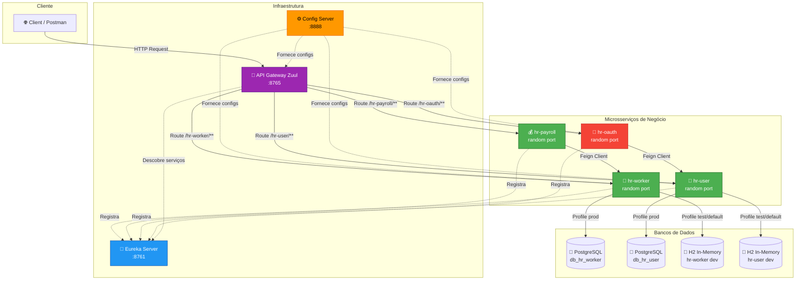
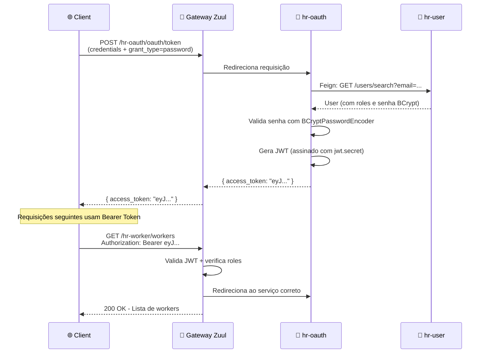
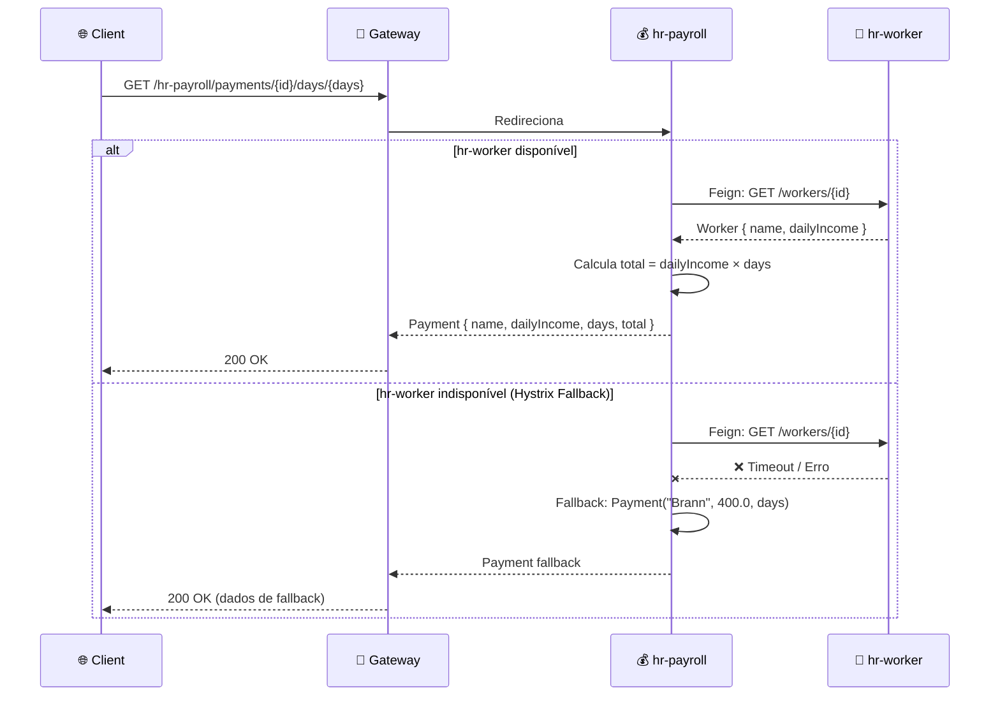

# 🏢 HR Microservices — Spring Boot & Spring Cloud

<div align="center">


**Sistema de RH baseado em arquitetura de microsserviços com service discovery, API gateway, configuração centralizada, autenticação OAuth2/JWT e circuit breaker.**

</div>

---

# 📑 Índice

- [🏛️ Arquitetura](#️-arquitetura)
- [🧩 Módulos do Projeto](#-módulos-do-projeto)
- [⚙️ Stack Tecnológica](#️-stack-tecnológica)
- [🔧 Configuração Centralizada & Profiles](#-configuração-centralizada--profiles)
- [🚀 Como Executar](#-como-executar)
- [🐘 Banco de Dados PostgreSQL](#-banco-de-dados-postgresql)
- [🔐 Autenticação e Autorização](#-autenticação-e-autorização)
- [📮 API & Collection Postman](#-api--collection-postman)
- [🛠️ Configuração do VS Code](#️-configuração-do-vs-code)
- [📂 Estrutura do Projeto](#-estrutura-do-projeto)

---

# 🏛️ Arquitetura

O projeto segue o padrão de arquitetura de microsserviços, onde cada serviço possui responsabilidade isolada e se comunica via REST. Toda a infraestrutura é orquestrada por componentes do Spring Cloud.

## Diagrama Geral



## Fluxo de Autenticação



## Fluxo de Cálculo de Pagamento (com Circuit Breaker)



---

# 🧩 Módulos do Projeto

O projeto é organizado como um **multi-module Maven** com um POM pai (`hr-parent`) que centraliza versões e dependências comuns.

| Módulo | Porta | Descrição |
|--------|-------|-----------|
| **hr-config-server** | `8888` | Servidor de configuração centralizado. Busca propriedades de um repositório Git e as distribui para os microsserviços clientes. |
| **hr-eureka-server** | `8761` | Service Discovery. Todos os microsserviços se registram aqui e descobrem uns aos outros por nome lógico. |
| **hr-api-gateway-zuul** | `8765` | API Gateway — ponto único de entrada. Faz roteamento, balanceamento de carga e aplica regras de segurança OAuth2/JWT. |
| **hr-worker** | Aleatória | Microsserviço de trabalhadores. CRUD de `Worker` (id, name, dailyIncome). Conecta-se a PostgreSQL (prod) ou H2 (dev/test). |
| **hr-payroll** | Aleatória | Microsserviço de folha de pagamento. Consome `hr-worker` via Feign Client para calcular pagamentos. Implementa Hystrix como circuit breaker. |
| **hr-user** | Aleatória | Microsserviço de usuários. Gerencia `User` e `Role` com autenticação BCrypt. Conecta-se a PostgreSQL (prod) ou H2 (dev/test). |
| **hr-oauth** | Aleatória | Servidor de autorização OAuth2. Gera e valida tokens JWT. Consome `hr-user` via Feign para autenticar usuários. |

> **💡 Nota:** Os serviços de negócio usam portas aleatórias (`server.port=${PORT:0}`) para permitir múltiplas instâncias registradas no Eureka, viabilizando o load balancing via Ribbon/Zuul.

---

# ⚙️ Stack Tecnológica

## Core

| Tecnologia | Versão | Função |
|-----------|--------|--------|
| **Java** | 11 | Linguagem de programação |
| **Spring Boot** | 2.3.12.RELEASE | Framework base para criação dos microsserviços |
| **Spring Cloud** | Hoxton.SR12 | Ecossistema para arquitetura distribuída |
| **Maven** | 3.x | Build e gerenciamento de dependências (multi-module) |

## Spring Cloud Components

| Componente | Dependência Maven | Onde é usado | Finalidade |
|-----------|-------------------|--------------|-----------| 
| **Config Server** | `spring-cloud-config-server` | hr-config-server | Servir configurações centralizadas via Git |
| **Config Client** | `spring-cloud-starter-config` | hr-worker, hr-user, hr-oauth, hr-gateway | Consumir configurações do Config Server |
| **Eureka Server** | `spring-cloud-starter-netflix-eureka-server` | hr-eureka-server | Registro e descoberta de serviços |
| **Eureka Client** | `spring-cloud-starter-netflix-eureka-client` | Todos (exceto config-server) | Registrar-se no Eureka |
| **Zuul** | `spring-cloud-starter-netflix-zuul` | hr-api-gateway-zuul | API Gateway com roteamento e load balancing |
| **OpenFeign** | `spring-cloud-starter-openfeign` | hr-payroll, hr-oauth | Comunicação declarativa entre microsserviços |
| **Hystrix** | `spring-cloud-starter-netflix-hystrix` | hr-payroll | Circuit breaker para tolerância a falhas |
| **OAuth2** | `spring-cloud-starter-oauth2` | hr-oauth, hr-gateway | Autenticação e autorização com JWT |
| **Ribbon** | (embutido no Zuul/Feign) | hr-gateway, hr-payroll | Client-side load balancing |

## Persistência

| Tecnologia | Versão | Onde é usado | Finalidade |
|-----------|--------|--------------|-----------| 
| **Spring Data JPA** | (Spring Boot managed) | hr-worker, hr-user | ORM com Hibernate para acesso a dados |
| **PostgreSQL** | 12-alpine | hr-worker (prod), hr-user (prod/dev) | Banco de dados relacional em produção |
| **H2 Database** | 2.2.220 | hr-worker (dev/test), hr-user (dev/test) | Banco in-memory para desenvolvimento |

## Ferramentas e Utilitários

| Tecnologia | Finalidade |
|-----------|-----------|
| **Lombok** (1.18.24) | Redução de boilerplate (getters, constructors, etc.) |
| **Spring Boot DevTools** | Hot reload em desenvolvimento |
| **Spring Boot Actuator** | Endpoints de monitoramento e refresh de configuração |
| **Docker** | Containerização dos microsserviços |

---

# 🔧 Configuração Centralizada & Profiles

O **hr-config-server** busca arquivos `.properties` do repositório Git e os distribui via HTTP. Cada microsserviço cliente possui profiles (`default`, `dev`, `test`, `prod`) que determinam banco de dados, credenciais e comportamento.

| Microsserviço | Profiles Disponíveis | Banco (prod) | Banco (dev/test) |
|---------------|---------------------|--------------|-------------------|
| **hr-worker** | `default`, `test`, `dev`, `prod` | PostgreSQL (`hr-worker-pg12:5432`) | H2 in-memory |
| **hr-user** | `default`, `dev`, `prod` | PostgreSQL (`hr-user-pg12:5432`) | H2 in-memory |

> 📖 **Documentação completa:** profiles, propriedades globais (OAuth/JWT) e atualização dinâmica com Actuator em [docs/CONFIGURATION.md](docs/CONFIGURATION.md)

---

# 🚀 Como Executar

## Quick Start (Profile Dev — H2 in-memory)

A forma mais rápida de rodar o projeto localmente sem PostgreSQL:

```bash
# Build
mvn clean install -DskipTests

# Iniciar na ordem (cada comando em um terminal separado)
java -jar hr-config-server/target/hr-config-server-0.0.1-SNAPSHOT.jar
java -jar hr-eureka-server/target/hr-eureka-server-0.0.1-SNAPSHOT.jar
java -jar hr-worker/target/hr-worker-0.0.1-SNAPSHOT.jar --spring.profiles.active=test --spring.cloud.config.uri=http://localhost:8888 --eureka.client.service-url.defaultZone=http://localhost:8761/eureka/
java -jar hr-user/target/hr-user-0.0.1-SNAPSHOT.jar --spring.profiles.active=test --spring.cloud.config.uri=http://localhost:8888 --eureka.client.service-url.defaultZone=http://localhost:8761/eureka/
java -jar hr-oauth/target/hr-oauth-0.0.1-SNAPSHOT.jar --spring.cloud.config.uri=http://localhost:8888 --eureka.client.service-url.defaultZone=http://localhost:8761/eureka/
java -jar hr-payroll/target/hr-payroll-0.0.1-SNAPSHOT.jar --eureka.client.service-url.defaultZone=http://localhost:8761/eureka/
java -jar hr-api-gateway-zuul/target/hr-api-gateway-zuul-0.0.1-SNAPSHOT.jar --spring.cloud.config.uri=http://localhost:8888 --eureka.client.service-url.defaultZone=http://localhost:8761/eureka/
```

> 📖 **Guia completo:** execução local com PostgreSQL (profile `dev`), deploy Docker (profile `prod`), build de imagens e mapa de portas em [docs/GETTING_STARTED.md](docs/GETTING_STARTED.md)

---

# 🐘 Banco de Dados PostgreSQL

Dois bancos `postgres:12-alpine` independentes — um para cada microsserviço com persistência:

| Container | Database | Porta (dev) | Porta (prod) |
|-----------|----------|-------------|--------------|
| `hr-worker-pg12` | `db_hr_worker` | `5432` | `5432` |
| `hr-user-pg12` | `db_hr_user` | `5433` | `5432` |

> 📖 **Schemas completos**, scripts DDL, dados de seed e diagrama ER em [docs/DATABASE.md](docs/DATABASE.md)

---

# 🔐 Autenticação e Autorização

O sistema usa **OAuth2 com Password Grant** e tokens **JWT**. O `hr-oauth` gera tokens, e o **API Gateway** os valida antes de rotear requisições.

| Usuário | Email | Senha | Roles |
|---------|-------|-------|-------|
| Nina Brown | `nina@gmail.com` | `123456` | `ROLE_OPERATOR` |
| Leia Red | `leia@gmail.com` | `123456` | `ROLE_OPERATOR`, `ROLE_ADMIN` |

```bash
# Obter token JWT
curl -X POST http://localhost:8765/hr-oauth/oauth/token \
  -u "myappname123:myappsecret123" \
  -d "username=leia@gmail.com&password=123456&grant_type=password"
```

> 📖 **Detalhes completos:** modelo de segurança, regras de acesso por rota e diagramas em [docs/AUTHENTICATION.md](docs/AUTHENTICATION.md)

---

# 📮 API & Collection Postman

O diretório [`docs/`](docs/) contém uma collection Postman pronta com todos os endpoints:

| Arquivo | Descrição |
|---------|-----------|
| [`postman-collection.json`](docs/postman-collection.json) | Collection com endpoints organizados por serviço |
| [`postman-environment.json`](docs/postman-environment.json) | Variáveis de ambiente (url-base, token, credentials) |

> 📖 **Referência completa da API:** todos os endpoints por serviço, variáveis de ambiente e exemplos em [docs/API.md](docs/API.md)

---

# 🛠️ Configuração do VS Code

## Supressão de avisos do Spring Boot

Como este projeto utiliza uma versão mais antiga do Spring Boot, configure `.vscode/settings.json`:

```json
{
    "boot-java.validation.java.version-validation": "OFF"
}
```

## Launch Configurations

Use o arquivo [`docs/launch.json`](docs/launch.json) como base para debug. Copie-o para `.vscode/launch.json`. Ele contém configurações pré-definidas para cada microsserviço com portas JMX dedicadas.

---

# 📂 Estrutura do Projeto

```
📦 curso-udemy-microsservicos-java-com-spring-boot-e-spring-cloud
├── 📄 pom.xml                          # Parent POM (multi-module)
├── 📁 docs/
│   ├── 📄 API.md                       # Referência completa da API
│   ├── 📄 AUTHENTICATION.md            # Autenticação e autorização
│   ├── 📄 CONFIGURATION.md             # Configuração centralizada & profiles
│   ├── 📄 DATABASE.md                  # Schemas e setup do PostgreSQL
│   ├── 📄 GETTING_STARTED.md           # Guia completo de execução
│   ├── 📄 launch.json                  # VS Code debug configs
│   ├── 📄 postman-collection.json      # Postman collection
│   └── 📄 postman-environment.json     # Postman environment
│
├── 📁 hr-config-server/                # ⚙️ Configuração Centralizada
│   ├── 📄 Dockerfile
│   ├── 📄 pom.xml
│   ├── 📁 configs/                     # Propriedades servidas aos clientes
│   │   ├── 📄 application.properties   # Props globais (oauth, jwt)
│   │   ├── 📄 hr-worker.properties     # Worker — profile default
│   │   ├── 📄 hr-worker-dev.properties # Worker — profile dev (Postgres)
│   │   ├── 📄 hr-worker-test.properties# Worker — profile test
│   │   ├── 📄 hr-worker-prod.properties# Worker — profile prod (Postgres Docker)
│   │   ├── 📄 hr-user-dev.properties   # User — profile dev (Postgres)
│   │   └── 📄 hr-user-prod.properties  # User — profile prod (Postgres Docker)
│   └── 📁 src/
│
├── 📁 hr-eureka-server/                # 📡 Service Discovery
│   ├── 📄 Dockerfile
│   ├── 📄 pom.xml
│   └── 📁 src/
│
├── 📁 hr-api-gateway-zuul/             # 🚪 API Gateway
│   ├── 📄 Dockerfile
│   ├── 📄 pom.xml
│   └── 📁 src/
│
├── 📁 hr-worker/                       # 👷 Serviço de Trabalhadores
│   ├── 📄 Dockerfile
│   ├── 📄 pom.xml
│   ├── 📄 create.sql                   # DDL + seed para Postgres
│   └── 📁 src/
│
├── 📁 hr-payroll/                      # 💰 Serviço de Folha de Pagamento
│   ├── 📄 Dockerfile
│   ├── 📄 pom.xml
│   └── 📁 src/
│
├── 📁 hr-user/                         # 👤 Serviço de Usuários
│   ├── 📄 Dockerfile
│   ├── 📄 pom.xml
│   ├── 📄 create.sql                   # DDL + seed para Postgres
│   └── 📁 src/
│
└── 📁 hr-oauth/                        # 🔑 Serviço de Autenticação
    ├── 📄 Dockerfile
    ├── 📄 pom.xml
    └── 📁 src/
```

---

<div align="center">

**Desenvolvido durante o curso de Microsserviços Java com Spring Boot e Spring Cloud**

⭐ Se este repositório foi útil, considere dar uma star!

</div>