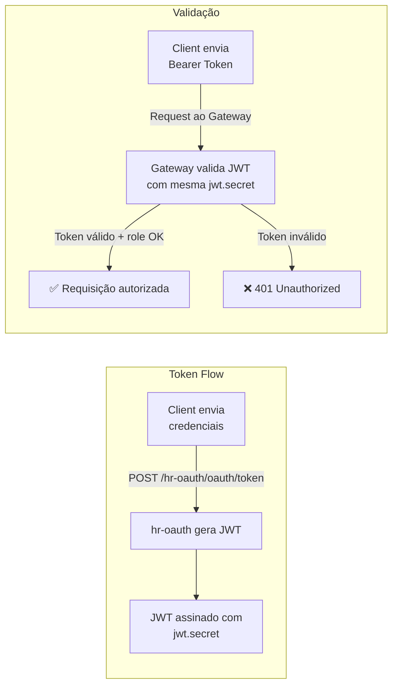

# 🔐 Autenticação e Autorização

## Modelo de Segurança

O sistema usa **OAuth2 com Password Grant** e tokens **JWT**:



## Usuários de teste

| Usuário | Email | Senha | Roles |
|---------|-------|-------|-------|
| Nina Brown | `nina@gmail.com` | `123456` | `ROLE_OPERATOR` |
| Leia Red | `leia@gmail.com` | `123456` | `ROLE_OPERATOR`, `ROLE_ADMIN` |

## Regras de acesso no Gateway

| Rota | Método | Role necessária |
|------|--------|----------------|
| `/hr-oauth/oauth/token` | POST | 🔓 Público |
| `/hr-worker/**` | GET | `OPERATOR` ou `ADMIN` |
| `/hr-payroll/**` | Todos | `ADMIN` |
| `/hr-user/**` | Todos | `ADMIN` |
| `/actuator/**` | Todos | `ADMIN` |
| Demais rotas | Todos | Autenticado |

## Exemplo de login via cURL

```bash
# Obter token JWT
curl -X POST http://localhost:8765/hr-oauth/oauth/token \
  -u "myappname123:myappsecret123" \
  -d "username=leia@gmail.com&password=123456&grant_type=password"

# Usar o token em requisições
curl -H "Authorization: Bearer <TOKEN>" \
  http://localhost:8765/hr-worker/workers
```
