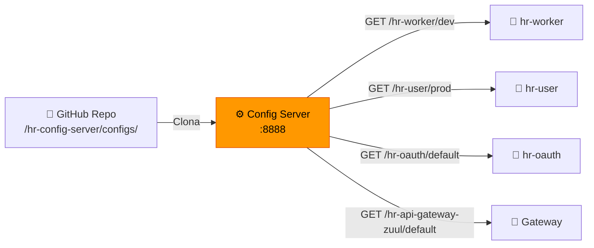

# 🔧 Configuração Centralizada & Profiles

O **hr-config-server** é o coração da configuração. Ele busca arquivos `.properties` de um diretório `configs/` no repositório Git e os distribui aos microsserviços clientes via HTTP.

## Como funciona



## Propriedades Globais (`application.properties`)

Compartilhadas por **todos** os microsserviços clientes que consultam o Config Server:

| Propriedade | Valor | Descrição |
|------------|-------|-----------|
| `oauth.client.name` | `myappname123` | Nome do cliente OAuth2 |
| `oauth.client.secret` | `myappsecret123` | Secret do cliente OAuth2 |
| `jwt.secret` | `MY-SECRET-KEY` | Chave de assinatura JWT |

## Profiles Disponíveis

### 🟢 `hr-worker`

| Profile | Banco | Host DB | Porta DB | Banco de Dados | DDL Auto | Detalhes |
|---------|-------|---------|----------|----------------|----------|----------|
| **default** | H2 (in-memory) | — | — | mem | `create` (padrão JPA) | Usa `import.sql` para seed. Possui `test.config=My config value default profile` |
| **test** | H2 (in-memory) | — | — | mem | `create` (padrão JPA) | Possui `test.config=My config value test profile update` |
| **dev** | PostgreSQL | `localhost` | `5432` | `db_hr_worker` | `none` | Gera script DDL em `hr-worker/create.sql` |
| **prod** | PostgreSQL | `hr-worker-pg12` | `5432` | `db_hr_worker` | `none` | Conecta ao container Docker `hr-worker-pg12` |

### 🟢 `hr-user`

| Profile | Banco | Host DB | Porta DB | Banco de Dados | DDL Auto | Detalhes |
|---------|-------|---------|----------|----------------|----------|----------|
| **default** | H2 (in-memory) | — | — | mem | `create` (padrão JPA) | Usa `import.sql` para seed com usuários e roles |
| **dev** | PostgreSQL | `localhost` | `5433` | `db_hr_user` | `none` | Gera script DDL em `hr-user/create.sql`. Porta `5433` (diferente do hr-worker) |
| **prod** | PostgreSQL | `hr-user-pg12` | `5432` | `db_hr_user` | `none` | Conecta ao container Docker `hr-user-pg12` |

## Atualização dinâmica com Actuator

Os serviços que possuem `@RefreshScope` (como `hr-worker`) podem ter suas configurações atualizadas em runtime:

```bash
# Atualizar configs do hr-worker sem reiniciar
POST http://localhost:8765/hr-worker/actuator/refresh
```
