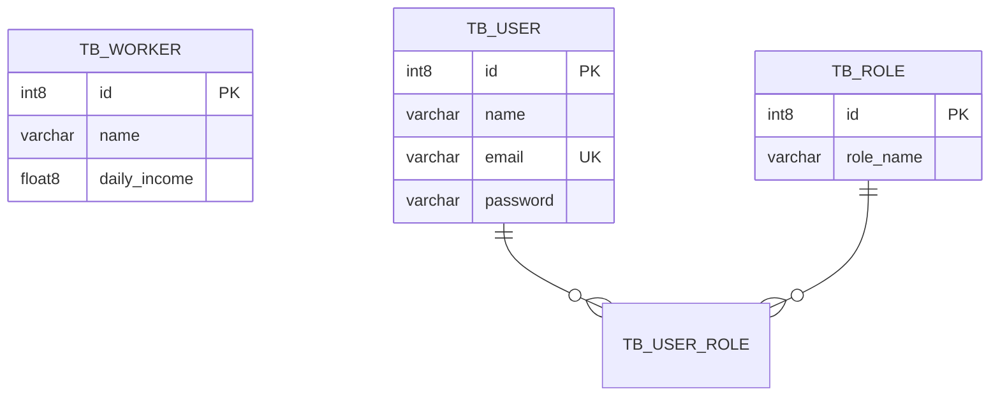

# 🐘 Banco de Dados PostgreSQL

## Configuração dos containers

Ambos os bancos utilizam a imagem `postgres:12-alpine`:

| Parâmetro | hr-worker | hr-user |
|-----------|-----------|---------|
| **Container** | `hr-worker-pg12` | `hr-user-pg12` |
| **Database** | `db_hr_worker` | `db_hr_user` |
| **Usuário** | `postgres` | `postgres` |
| **Senha** | `1234567` | `1234567` |
| **Porta Host (dev)** | `5432` | `5433` |
| **Porta Host (prod)** | `5432` | `5433` |

---

## Schema — `db_hr_worker`

```sql
CREATE TABLE tb_worker (
    id      INT8 GENERATED BY DEFAULT AS IDENTITY,
    name    VARCHAR(255),
    daily_income FLOAT8,
    PRIMARY KEY (id)
);

-- Dados de seed
INSERT INTO tb_worker (name, daily_income) VALUES ('Bob', 200.0);
INSERT INTO tb_worker (name, daily_income) VALUES ('Maria', 300.0);
INSERT INTO tb_worker (name, daily_income) VALUES ('Alex', 250.0);
```

---

## Schema — `db_hr_user`

```sql
CREATE TABLE tb_role (
    id        INT8 GENERATED BY DEFAULT AS IDENTITY,
    role_name VARCHAR(255),
    PRIMARY KEY (id)
);

CREATE TABLE tb_user (
    id       INT8 GENERATED BY DEFAULT AS IDENTITY,
    email    VARCHAR(255) UNIQUE,
    name     VARCHAR(255),
    password VARCHAR(255),
    PRIMARY KEY (id)
);

CREATE TABLE tb_user_role (
    user_id INT8 NOT NULL,
    role_id INT8 NOT NULL,
    PRIMARY KEY (user_id, role_id),
    FOREIGN KEY (role_id) REFERENCES tb_role,
    FOREIGN KEY (user_id) REFERENCES tb_user
);

-- Dados de seed (senha: 123456 em BCrypt)
INSERT INTO tb_user (name, email, password) VALUES ('Nina Brown', 'nina@gmail.com', '$2a$10$NYFZ/8WaQ3Qb6FCs.00jce4nxX9w7AkgWVsQCG6oUwTAcZqP9Flqu');
INSERT INTO tb_user (name, email, password) VALUES ('Leia Red', 'leia@gmail.com', '$2a$10$NYFZ/8WaQ3Qb6FCs.00jce4nxX9w7AkgWVsQCG6oUwTAcZqP9Flqu');
INSERT INTO tb_role (role_name) VALUES ('ROLE_OPERATOR');
INSERT INTO tb_role (role_name) VALUES ('ROLE_ADMIN');
INSERT INTO tb_user_role (user_id, role_id) VALUES (1, 1);  -- Nina = OPERATOR
INSERT INTO tb_user_role (user_id, role_id) VALUES (2, 1);  -- Leia = OPERATOR
INSERT INTO tb_user_role (user_id, role_id) VALUES (2, 2);  -- Leia = ADMIN
```

---

## Diagrama de Entidades


